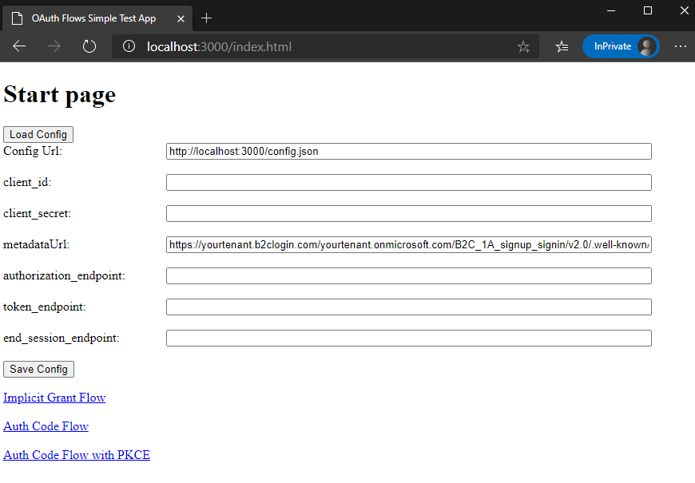
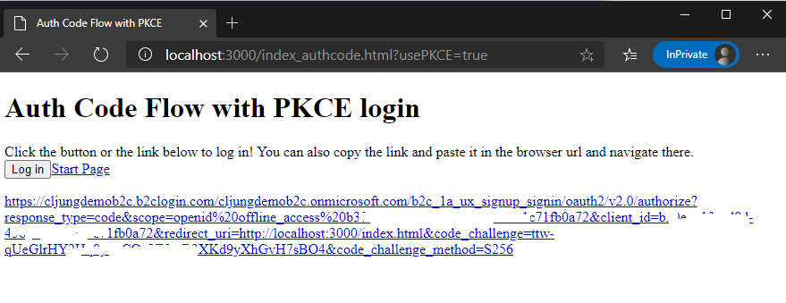
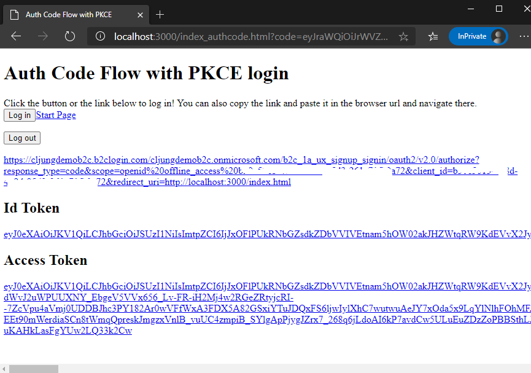

# oidc_simple_client
This is a simple OpenID Connect/OAuth2 html/javascript client that you can use to test the following flows

* Implicit Grant
* Auth Code flow
* Auth Code flow with PKCE
* ROPC

It uses no library, like MSAL, and implements all interactions with the Identity Provider using javascript

A live version of this webapp exists here [https://cljungoauthtest.azurewebsites.net/](https://cljungoauthtest.azurewebsites.net/)

## Configuration

Edit the config.json file to include your IDP settings. 

Items you must change are
- client_id - App registraion GUID
- metadataUrl - Endpoint where to find the IDP metadata

Items you may change are:
- client_secret - if you are testing testing the Auth Code flow (without PKCE), you need the client_secret
- endpoints - if you are able to retrieve the metadata, you can manually add the endpoints in the config file 

```json
{
	"client_id": "...guid...",
	"client_secret": "...secret key for webapp, blank for SPA/POKCE...",
	"scope": "openid offline_access {clienty_id}",
	"response_type": "code",
	"response_mode": "query",
	"PKCE": false,
	"ROPC": false,
	"redirectUrl": "http://localhost:3000/index.html",
	"authorization_endpoint": "",
	"token_endpoint": "", 
	"end_session_endpoint": "",
	"metadataUrl": "https://yourtenant.b2clogin.com/yourtenant.onmicrosoft.com/B2C_1A_signup_signin/v2.0/.well-known/openid-configuration"
}
```
## Running it

You can start the webapp easily using Node or Python (see [start-nodejs.ps1](start-nodejs.ps1) and [start-python.ps1](start-python.ps1) for details). 

At the start page, edit the url to your config file and press the ***Load Config***. Then, make any modifications you may need, like change client_id or endpoint urls, and then press ***Save Config***. This will set the config in the browsers local storage. Then select the flow you like to test.



The page per respective flow starts by showing the url that it is about to invoke to the IDP. You can click the link, copy the link to a separate tab or press the button.



After you go through the IDP authentication sequence, you will return to the same page with the id and access token displayed. There are hyperlinks to view the tokens in jwt.ms.



